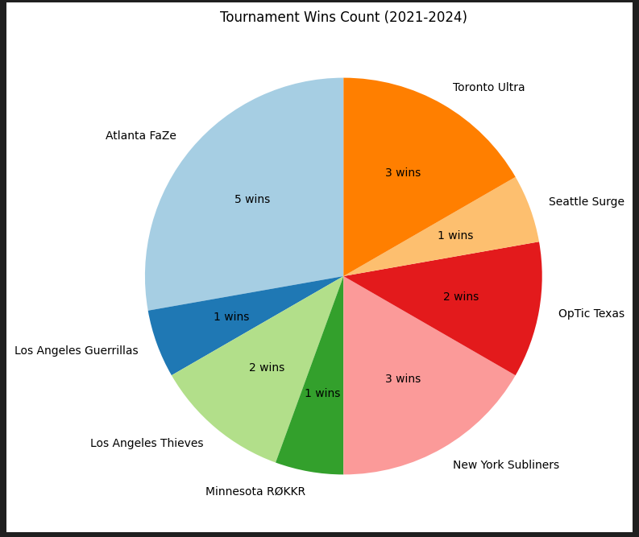
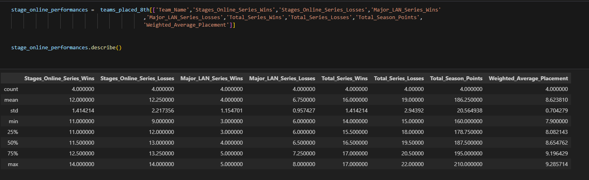
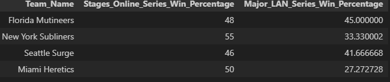

# CDL Team Performance Analysis (2021-2024)

This project analyzes the performance of CDL teams over four seasons (2021-2024). The analysis answers key questions about team consistency, success, performance in different environments, and the minimum thresholds needed to qualify for Champs.

## 1. Which CDL Teams have Consistently Performed Well?

### Overview

When answering this question we want to analysis which teams have maintained a high level of performance throughout all four seasons that are being evaluated. We are going to look into a line chart the demonstates all the teams season placings and average tournament placings.

#### - Tracking Season Placings
This line chart illustrates the season placings of CDL teams over the years, allowing us to visually track which teams have consistently performed well across multiple seasons.By showing the trends in team performance from year to year, we can easily identify teams that have maintained top placements and remained competitive throughout the CDL seasons.

#### - Tournament Averages
The heatmap below highlights the average tournament placements of CDL teams from 2021 to 2024. The colors in this heatmap represenet which teams placed better throughout the cdl, with darker shades of blue indicating worse placements. Looking into this heatmap we can quickly identify teams that have consistently placed higher in tournaments and who have done it more consistently.

### Key Insights

* The Team that has been consistently good in the CDL Season from (21-24) has been ATL FaZe with the best tournament placings and having been number 1 in season standings the past four years, right behind them is Optic Texas and Toronto Ultra who have been the other most consistent teams that are shown from these two visuals

* The Team that has been unconsistently the most is the Minnesota ROKKR one year they are getting into champs and the next getting close to the bottom.

* The Team that has been consistently bad has been the Legion team whether that is in the Las Vegas location or Paris Location , they have been the worse team in the CDL.

## 2. Which Team Has Been the Most Successful? 

### Overview

This section highlights the team that has secured the most tournament wins in the cdl era.

#### Tournament Wins 
In this Pie Chart it is illustrated which teams have dominated the most, and the percentages of those tournaments. This is EXCLUDING CHAMPS!

#### Percentage of those wins 

### Key Insights 

* Atlanta Faze Emerges as the most dominant team in cdl history so far. they have secured the most tournamnet wins plus a 2021 Cod Champs victory which is not accounted for in this chart but adds to there dominance in the CDL. New York and Toronto are not to far behind them. 

## 3. How do Teams Perform in Different Enviroments? 

### Overview 

This analysis compares team performance in online vs LAN settings. Understanding this distinction is key to determining where teams perform best.

#### Side by Side Bar Chart 

This visual will show the difference between teams win percentages online vs LAN torunamnents 

### Key Insights 

* Many of the teams perform better online becasue when you are playing online/qualifiers you are guarenteed to play a certain amount of games which is usually five which guarantee wins. Where in LAN you are not guarantee anything because many of the times games are you either win or you are out. That can be why we have many of the top teams with higher online win pct then there majors. However that does not go with many of the other teams , many of these teams players just perform better on LAN then Online.

* Teams like Los Angeles Guerrillas and Seattle Surge who have been around since 2021 have both prefered playing on LAN and have won many of there series on LAN. With both franchises winning in the 2022 season.

* Toronto Ultra and Los Angles Thieves are teams that are split between LAN and Online.

* With the Miami Herectics 2024 season being there first, have an upside of just performing online a lot better then LAN.

## 4. What are Key Factors for Qualifying for Champs? 

### Overview 

This is an analysis to understand the key factors for a team to qualify for champs, including season points , tournament placings, and understanding what future teams will have to do in order to qualify for champs in 2025. In this Analysis we filtered out all the 8th place teams from 2021 all the way to 2024 

#### Analysis 

In this image we can point out some key statistics that shows the average points, the amount of wins each of these 8th places teams get and a lot more that can help us understand what criterias you need to fullfill in order to get into the biggest COD tournamnet of the year.

### Key Insights 

* Average Points = 186.25
  - Looking into the average points you would want at least 160 points as the min for all teams was 160 and your goal would be 210 since that is what the highest value was.

* Total Series Averages , Wins = 16 , Losses = 19
  - Looking into these values you would want to win about 17 games as that is the max and not lose more than 22 games as that will have you disqualified

* describe analysis
  - When analyzing the 8th place teams you can see that the majority of them get there wins from online play
  - Meaning if your team can get consistently high placings on LAN and get points from both online play and LAN they should be in good spots because all 4 teams that have been in this position did not do that which can lead to you being in this posistion

* Majors vs Online Win percentages

# Conclusion 

This CDL dataset provides insights into all the teams that have participated in the COD League up until 2024. The dataset provided data on which teams have been the most dominant , analysis into which teams perform better on LAN then Online, and what it takes to qualify for champs.This analysis serves as a foundational understanding of CDL team dynamics over the past four seasons. 

